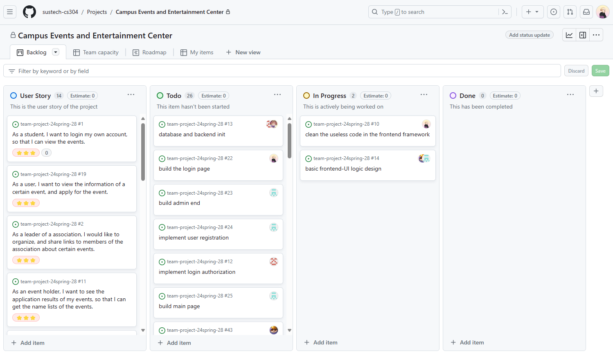
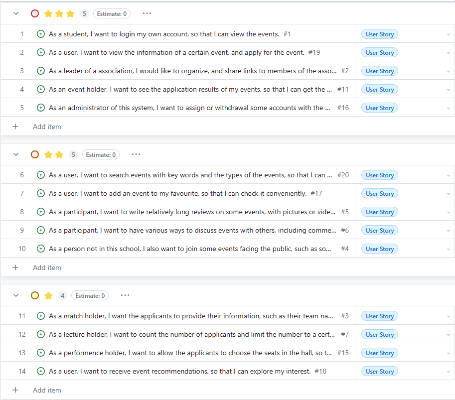

# CS304 Project Proposal

**Project name: Campus Events and Entertainment Center**

[PPT link](https://www.canva.cn/design/DAF_rurF4wg/NMOKZVrbbEFv28AQGcyhUg/view?utm_content=DAF_rurF4wg&utm_campaign=designshare&utm_medium=link&utm_source=editor)

## Part I. Project Proposal

### Project Overview

**Target Users or Clients:** The target users of the proposed system are university students, faculty, and staff members who are interested in participating in or organizing campus events and activities. Additionally, event organizers and administrators will also use the system to manage and promote events.

**Functionalities of the Proposed System:**

1. **Effortlessly Organize a Variety of Activities:** Users can utilize user-friendly features to organize a wide range of activities, leveraging preset options for easy event setup and public showcasing.

2. **Rate Activities and Share Memorable Moments:** Similar to reviewing movies, users can rate and comment on activities, sharing their experiences and thoughts with others.

3. **Discover Activities of Interest:** Users have the ability to explore activities based on categories or receive personalized recommendations for high-quality events directly on the homepage.

4. **Connect with Friends and Extend Invitations:** The system facilitates social interaction by allowing users to invite friends to join activities through the chat system or by sharing activity links on various social platforms.

5. **Share Activity Content and Experiences Through Posts:** Users can share activity content and reflections through posts, enriched with relevant tags. This feature encourages discussions among participants through comments on the posts.

**Overall Goal of the Proposed System:** The expected outcome of the proposed system is to create a centralized platform that enhances campus life by facilitating easy organization, discovery, participation, and social interaction around campus events and activities. The system aims to improve user engagement, foster community spirit, and promote a vibrant campus culture.

### Preliminary Requirement Analysis

#### Functional Requirements

1. **Effortlessly Organize a Variety of Activities**:
   
   The website offers a range of user-friendly features for organizing activities, including various presets. With just a few clicks, the events you organize can be showcased to the public.
   
2. **Rate Activities and Share Memorable Moments**:
   
   Similar to reviewing a movie, users can rate and comment on activities, sharing their thoughts and experiences.
   
3. **Discover Activities of Interest**:
   
   Users can explore activities based on categories or receive personalized recommendations for high-quality events on the homepage.
   
4. **Connect with Friends and Extend Invitations**:
   
   Easily invite friends to join activities through our chat system or share activity links on various social platforms, fostering more social interaction.
   
5. **Share Activity Content and Experiences Through Posts**:
   
   Users can share activity content and reflections through posts, enriched with relevant tags. Participants can engage in discussions by commenting on the posts.

#### Non-functional Requirements

1. **Security**:

   The system shall ensure that the user's account information is not leaked and misappropriated.

2. **Reliability**:

   The overall reliability of the system should reach more than 99%.

3. **Performance**:

   All query operations should return results within 2 seconds.

4. **Product Constraints**:

   The software system should be deployed on a separate server running Linux.

5. **Process Constraints**:

   The software system should complete the implementation and testing of all functions before the defense.

#### Data Requirements

1. **User Data**:

   **Requirements**: User registration information, personal preferences, and interests.

   **Data Acquisition**: Collect basic information through user registration forms or update personal preferences and interests through user settings.

2. **Activity Data**:

   **Requirements**: Detailed information about activities, dates, locations, and categories.

   **Data Acquisition**: Gather relevant information when users create or participate in activities, or integrate with third-party event platforms to obtain data.

3. **Rating and Comment Data**:

   **Requirements**: User ratings and comments for activities.

   **Data Acquisition**: Provide a rating and commenting feature, storing user-inputted data in the database.

4. **Social Interaction Data**:

   **Requirements**: User interactions, invitations, and shared activities.

   **Data Acquisition**: Record chat logs, invitation details, and data related to activity sharing on social platforms.

5. **Recommendation Data**:

   **Requirements**: User interest and behavior data for personalized recommendations.

   **Data Acquisition**: Analyze user activity history, ratings, and click behavior, using recommendation algorithms to generate personalized suggestions.

6. **Post and Discussion Data**:

   **Requirements**: User-generated posts, comments, and discussions.

   **Data Acquisition**: Record user-generated posts, comments, and discussions between users.

#### Technical Requirements

**Frontend:**
Vue3 + Element-Plus

**Backend:**
SpringBoot + PostgresSQL + JPA + Websocket + JWT

## Part II. Task Decomposition & Planning

The url for the project board: [Backlog · Campus Events and Entertainment Center (github.com)](https://github.com/orgs/sustech-cs304/projects/201)

**Backlog, the user stories and tasks**:

**Priority of the user stories**:

**Roadmap of our plan**:

## Part III. AI Usage

Our group comes up with the features, requirements, user stories, issues and tasks on our own, without AI assistance.

As the proposal requires, we try using AI to generate those contents and compare them with our works.

### Experiments

**AI we used: Github Copilot** (based on GPT-3.5)

### Have you used AI to propose features for the project?

#### Prompt:

propose features for the project: Please design and implement a "Campus Events and Entertainment Center" system, in which users can view information for SUSTech performances (e.g., musical concerts), distinguish lectures (e.g., by Turing Award recipients), competitions (football match, coding skill competitions), and other events. Users could also book tickets, make reservations, or write reviews. Specifically, Users can explore specific information about various events, including categories, maps, venues, etc. Users can make reservations, book seats, and purchase tickets for various events. The system also supports user reviews, communication, assistance, and (real-time) information sharing (e.g., video clips, pictures, etc.) for events and activities The system can provide event recommendations

#### Response:

Here are some proposed features for the "Campus Events and Entertainment Center" system:

1. **Event Browsing**: Users can browse information about various events, including musical concerts, lectures, competitions, etc. Detailed information about each event including categories, maps, venues, etc. should be available.
2. **Event Booking**: Users can make reservations, book seats, and purchase tickets for various events.
3. **User Reviews**: Users can write reviews for the events they have attended, sharing their experiences and impressions.
4. **Real-time Information Sharing**: Users can share real-time information about events, such as video clips, pictures, etc.
5. **User Communication**: Provide a platform for users to communicate their views and feelings about the events, as well as provide help and suggestions.
6. **Event Recommendations**: The system can recommend events that users may be interested in based on their behavior and preferences.
7. **User Account Management**: Users can create and manage their accounts, including viewing booking history, managing personal information, etc.
8. **Search and Filtering**: Users can search for specific events and filter results based on categories, dates, locations, etc.
9. **Notifications and Reminders**: The system can send notifications and reminders when the events booked by users are about to start.
10. **Mobile Device Support**: The system should support various mobile devices so that users can view event information and make bookings anywhere.

These features should meet the needs of most users for the "Campus Events and Entertainment Center" system. However, adjustments may be needed based on user feedback and business requirements during the actual development process.

### Have you used AI to conduct the preliminary requirement analysis (e.g., identify functional and non functional requirements)?

#### Prompt:

please identify functional and non functional requirements

#### Response:

Functional requirements define what a system is supposed to do. They describe the behavior of the system under certain conditions. For the "Campus Events and Entertainment Center" system, the functional requirements could include:

1. **Event Browsing**: The system should allow users to browse various events.
2. **Event Booking**: The system should allow users to make reservations, book seats, and purchase tickets.
3. **User Reviews**: The system should allow users to write and view reviews for events.
4. **Real-time Information Sharing**: The system should allow users to share real-time information about events.
5. **User Communication**: The system should provide a platform for users to communicate about events.
6. **Event Recommendations**: The system should recommend events based on user behavior and preferences.
7. **User Account Management**: The system should allow users to create and manage their accounts.
8. **Search and Filtering**: The system should allow users to search for events and filter results.
9. **Notifications and Reminders**: The system should send notifications and reminders to users.

Non-functional requirements define how a system is supposed to be. They describe the system's properties or characteristics. For the "Campus Events and Entertainment Center" system, the non-functional requirements could include:

1. **Performance**: The system should be able to handle a large number of users simultaneously.
2. **Reliability**: The system should be reliable, with minimal downtime.
3. **Usability**: The system should be user-friendly, with an intuitive interface.
4. **Security**: The system should protect user data and prevent unauthorized access.
5. **Scalability**: The system should be able to handle an increasing amount of work by adding resources.
6. **Maintainability**: The system should be easy to modify and update.
7. **Portability**: The system should work on various devices and platforms.
8. **Responsiveness**: The system should provide quick and timely responses to user actions.
9. **Availability**: The system should be available for use whenever needed.

### Have you used AI to generate user stories?

#### Prompt:

please generate user stories

#### Response:

User stories are a simple way to capture user requirements throughout a project. Here are some user stories for the "Campus Events and Entertainment Center" system:

1. As a user, I want to browse various events so that I can see what's happening on campus.
2. As a user, I want to view detailed information about each event, including categories, maps, and venues, so that I can decide whether to attend.
3. As a user, I want to make reservations, book seats, and purchase tickets for events so that I can secure my participation.
4. As a user, I want to write reviews for events I have attended so that I can share my experiences and impressions.
5. As a user, I want to share real-time information about events, such as video clips and pictures, so that others can see what's happening.
6. As a user, I want to communicate with other users about events so that I can share views and feelings.
7. As a user, I want to receive event recommendations based on my behavior and preferences so that I can discover events I might be interested in.
8. As a user, I want to create and manage my account so that I can view my booking history and manage my personal information.
9. As a user, I want to search for specific events and filter results based on categories, dates, locations, etc., so that I can find events that meet my criteria.
10. As a user, I want to receive notifications and reminders when the events I booked are about to start so that I don't miss them.
11. As a user, I want the system to support various mobile devices so that I can view event information and make bookings anywhere.

### Have you used AI to generate issues or tasks?

#### Prompt:

please generate tasks from the first three user stories

#### Response:

Sure, here are the tasks generated from the first three user stories:

**User Story 1: As a user, I want to browse various events so that I can see what's happening on campus.**

Tasks:

1. Design the event listing page layout.
2. Implement the backend API to fetch event data.
3. Display the event data on the event listing page.
4. Test the event listing page on different devices and browsers.

**User Story 2: As a user, I want to view detailed information about each event, including categories, maps, and venues, so that I can decide whether to attend.**

Tasks:

1. Design the event detail page layout, including sections for categories, maps, and venues.
2. Implement the backend API to fetch detailed event data.
3. Display the detailed event data on the event detail page.
4. Test the event detail page on different devices and browsers.

**User Story 3: As a user, I want to make reservations, book seats, and purchase tickets for events so that I can secure my participation.**

Tasks:

1. Design the booking interface, including seat selection and ticket purchasing options.
2. Implement the backend API to handle booking requests and process payments.
3. Connect the booking interface with the backend API.
4. Test the booking process, including seat selection and ticket purchasing.

### Comparison and Analysis

As you can see, we do not use AI-generated responses directly. AI can help us analyze project requirement documents, ensuring that we do not miss any important information. It can identify key functional requirements, non-functional requirements, user stories, tasks, etc., and organize this information into an easy-to-understand and manageable format. However, AI cannot replace human judgment and decision-making, it is just a tool that helps us process information more effectively. Human creativity in this area cannot currently be replaced by AI.
