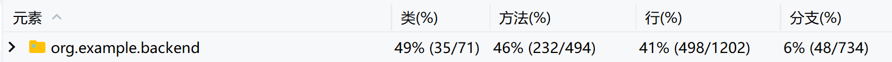
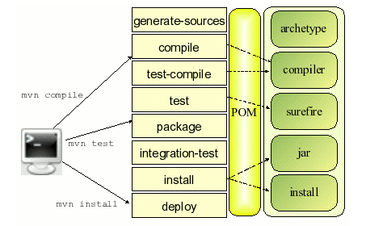
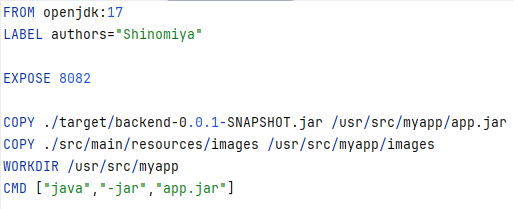
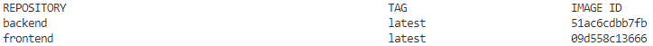
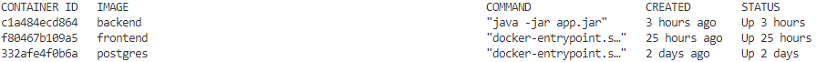
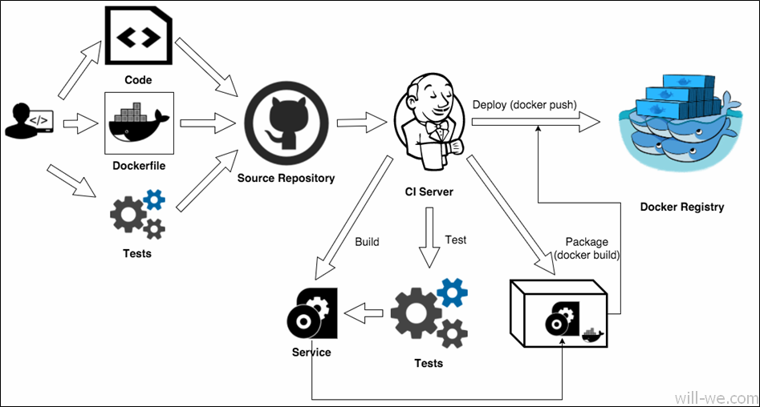
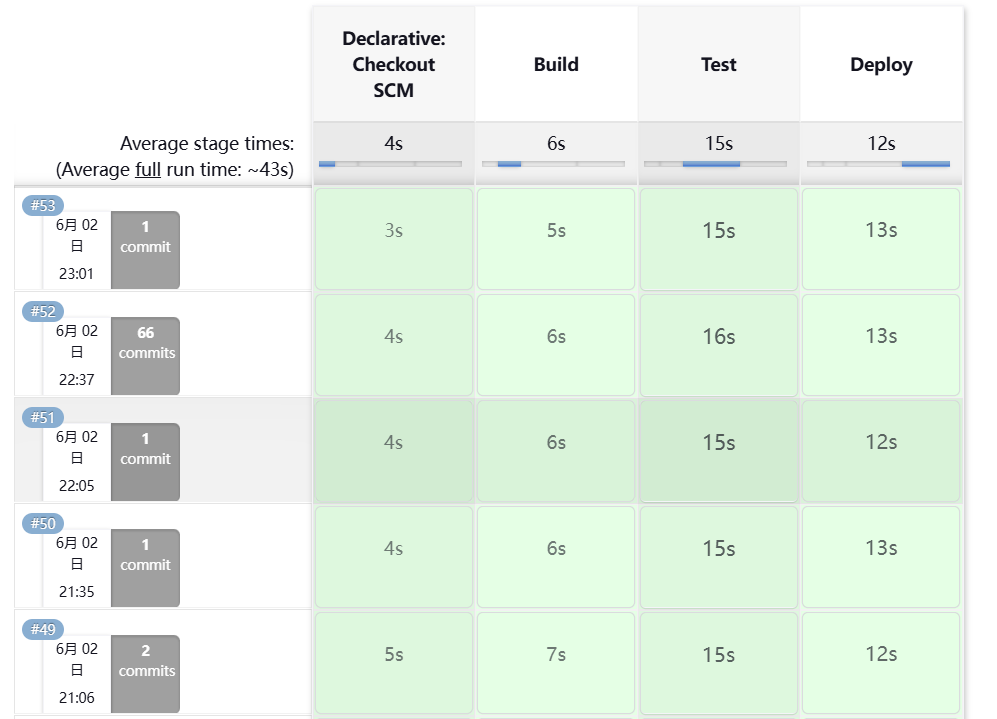

# CS304 Project Sprint2 Report

---

**Project Title: Campus Events and Entertainment Center**

---

## Part 1: Metrics

Here we use **JArchitect** to evaluate the complexity of our project, its test report can cover lots of metrics including but not limited to Lines of Code, Number of packages/modules, Number of source files and Number of dependencies.
The specific results are shown in the figure below:

## Part 2: Documentation

- Documentation for end users:
  [user_manual](前端用户手册.md)

- Documentation for developers:
  [apidocs](files/backend/apidocs/index.html)

## Part 3: Tests

In test part, we use **Spring Boot Test** and **MockMvc** for unit tests. [Source code](https://github.com/sustech-cs304/team-project-24spring-28/blob/d60183c49150c30591971fdc4a607ff9c6cbd73c/backend/src/test/java/org/example/backend/BackendApplicationTests.java)

**Spring Boot Test** is a module provided by Spring Boot for testing purposes. It simplifies the setup and writing of tests for Spring Boot applications. 

**MockMvc** is a part of the Spring Test module and provides a powerful way to test Spring MVC applications. It allows us to send HTTP requests to the DispatcherServlet and make assertions about the resulting responses.

Finally, we achieved decent coverage through simple automated testing. Meanwhile, considering convenience, we completed other detailed testing section through manual testing.

[test coverage report](files/backend/htmlReport/index.html)

## Part 4: Build

In build part, we use **Maven** to manage our project. The following is the basic lifecycle of Maven:

For the project, we used maven's default compilation and packaging process to build the project, in addition, we also use **pmd** to check the code quality and **javadoc** to generate the documentation.
After the build process, we can get the corresponding .jar package and documentations like apidocs.

Here is the Buildfile of our project: [pom.xml](files/backend/pom.xml)

## Part 5: Deployment

In deployment part, we use **Docker** to deploy our project to our server. We have built several docker images for different parts of our project, including **backend**, **frontend** and **database**.
Due to the database image building is relatively simple, and its image and container doesn't need change, we only show the Dockerfile of backend and frontend here.

Backend Dockerfile:

Frontend Dockerfile:

Here is the result of our deployment:

At the same time to make our development process more convenient, we use **Jenkins** to automate the build and deployment process. Like the following figure shows:

Here is the Jenkinsfile of our project: [Jenkinsfile](files/backend/Jenkinsfile)

Following is the recent results of our Jenkins pipeline:

